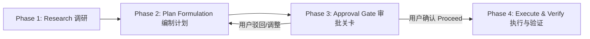

# Planning Mode (计划驱动实施工作流)

本 Skill 提供了一套标准化的**规范驱动开发（Spec-Driven Development）**与**人机协同审批（Human-in-the-Loop Approval Gate）**工作流程。

无论是 Antigravity、Claude Code、Cursor、Windsurf，还是基于 LangChain / AutoGPT 搭建的自主 Agent，都可以通过本规范实现**“先调研对齐方案，待人类确认后再动手编码，最后以证据验收”**的高可靠研发模式。

---

## 1. 触发判断矩阵（何时规划，何时直出）

Agent 收到开发任务后，首先根据以下规则评估是否进入 **Planning Mode**：

### 必须进入 Planning Mode 的场景：
- **涉及架构或接口变更**：新增数据模型、公共 API、状态管理或重大组件重构。
- **跨模块/多文件改动**：涉及 3 个以上文件的逻辑联动修改。
- **存在多种技术选型或明显歧义**：有多种设计路线（如方案 A vs 方案 B），需要用户拍板。
- **高风险/破坏性操作**：破坏向后兼容性、数据库 Migration、删除旧模块等。

### 不进入 Planning Mode（直接执行）的场景：
- **调查答疑**：例如“这个函数怎么调”、“查找某逻辑在哪个文件”。
- **单点微调/语法修复**：修复拼写错误、单行 Bug、调整 CSS 边距、补全单行类型。
- **已批准计划的简单延伸**：用户在刚确认过的计划下继续说“再加个单元测试”、“给这个函数加个注释”。

---

## 2. 核心执行四阶段（4-Phase Lifecycle）



### Phase 1: Research（只读调研）
**原则：绝对只读，禁止修改任何代码！**
1. **定位上下文**：使用文件查找、关键词全局搜索定位核心代码。
2. **分析调用关系**：排查接口被哪些上层业务调用，排查底层依赖。
3. **识别既有模式**：遵从当前代码库的命名规范、错误处理模式和项目结构。
4. **评估爆炸半径（Blast Radius）**：预估改动可能影响的其他模块与功能。

### Phase 2: Plan Formulation（编制实施计划）
生成标准格式的实施计划（写入工件文件或保存为 `implementation_plan.md`）。计划必须严格包含以下 5 个部分（详见 `references/implementation_plan_template.md`）：
1. **Goal Description**：一句话阐明目标与核心价值。
2. **User Review Required（用户必须注意的决策点）**：
   - 标注是否有 Breaking Changes。
   - 标注关键设计权衡（Trade-offs）与选型理由。
3. **Open Questions（待确认问题）**：列出可能阻碍实施或需要用户明确偏好的问题。
4. **Proposed Changes（变更拆解清单）**：
   - 按组件/模块分块。
   - 明确标记 `[NEW]`（新建）、`[MODIFY]`（修改）、`[DELETE]`（删除）。
   - 给出具体文件相对路径、受影响的核心类/函数/接口名，以及具体修改意图。
5. **Verification Plan（验证方案）**：
   - **自动化测试**：具体运行的测试命令（如 `pytest`, `npm test`）及需要补充的测试用例。
   - **手动验证**：端到端验证步骤、UI 检查点或 API 请求示例。

### Phase 3: Human Approval Gate（人工确认关卡，核心阻塞点）
**原则：在用户未明确确认（如点击 Proceed、回复“同意/继续/开始”）前，绝对不得修改任何源文件或执行破坏性操作！**

- **在支持 Artifacts 的环境（如 Antigravity）**：
  - 调用 `write_to_file` 创建 `implementation_plan.md`，并将元数据设置为 `RequestFeedback: true`, `UserFacing: true`。
  - 界面会弹出专用的审批面板与确认按钮。
- **在标准 CLI / 对话式 Agent（如 Claude Code, Cursor, 自建 Agent）**：
  - 将实施方案输出或写入项目临时文件（如 `.agent/plan.md`）。
  - 输出明确的提示语暂停当前轮次：
    > “我已经完成了代码调研并制定了实施计划。在开始执行前，请确认方案是否符合你的预期；如果有需要调整的地方，请随时指出。若确认无误，请回复‘确认执行/Proceed’。”
  - **停止调用任何工具，等待用户输入**。

### Phase 4: Execute & Verify（最小一致执行与证据闭环）
获得用户批准后进入本阶段：
1. **最小一致改动**：严格按照计划改动文件，不做无关的代码美化或未经计划的重构。
2. **执行验证**：
   - 运行自动化测试或 Lint 命令，确保现有测试通过且新增测试覆盖业务诉求。
   - 若测试失败，优先在计划范围内排查解决，不得掩耳盗铃跳过测试。
3. **生成 Walkthrough（验收证据报告）**：
   - 生成 `walkthrough.md`（参照 `references/walkthrough_template.md`）。
   - 记录具体修改的文件清单、执行的测试命令及真实输出日志、手动验证结论。

---

## 3. 各 Agent 平台的适配接入指南

### 1. Google Antigravity
- 直接使用系统内置的 `<planning_mode>` 机制。
- 工具协议：通过 `write_to_file` 写入 `<appDataDir>/brain/<conversation-id>/implementation_plan.md`，携带 `ArtifactMetadata`。
- 验收阶段通过 `walkthrough.md` 呈现结果。

### 2. Claude Code (`CLAUDE.md`)
在项目根目录或 `~/.claude/CLAUDE.md` 中增加指令：
```markdown
## Development Workflow: Planning Mode
Before making non-trivial changes (>2 files, architectural refactor, API changes):
1. Explore codebase in read-only mode.
2. Formulate a plan in `docs/plans/implementation_plan.md` following the Planning Mode schema.
3. STOP and ask the user for approval. DO NOT touch code until user confirms.
4. Execute changes and verify with tests. Document outcome in `docs/plans/walkthrough.md`.
```

### 3. Cursor (`.cursorrules` 或 `.cursor/rules/`)
创建规则文件 `.cursor/rules/planning-mode.mdc`：
```markdown
---
description: Enforce spec-driven planning mode for non-trivial coding tasks
globs: *
alwaysApply: true
---
When tasked with multi-file refactoring, new features, or architectural changes:
1. Conduct read-only research first.
2. Present a detailed Implementation Plan covering User Review points, Proposed Changes ([NEW]/[MODIFY]/[DELETE]), and Verification Plan.
3. Halt execution and wait for user's explicit approval before applying code edits.
4. After implementation, run tests and present proof of verification.
```

### 4. 自研 Agent 框架（LangChain, LlamaIndex, AutoGen 等）
在 Agent 的 System Prompt 中植入如下状态机约束：
- 状态 `STATE_RESEARCH` -> `STATE_PLANNING` -> `STATE_WAIT_FOR_APPROVAL` -> `STATE_EXECUTING` -> `STATE_VERIFYING`。
- 在 `STATE_WAIT_FOR_APPROVAL` 状态下，拦截一切具有写权限的 Tool Call，强行将转交给用户确认。

---

## 4. 核心成功准则（Rule Checklist）

1. **上下文优先**：动手前必须读懂被调用方与调用链，严禁“盲改”。
2. **文件级粒度**：计划必须精确到具体文件和具体改动点，严禁泛泛而谈（如“优化后端逻辑”）。
3. **明确拦截点**：计划制定完成后必须停下，严禁一口气直接边写计划边改完代码。
4. **证据闭环**：任务完成的标准是“有可验证的测试/运行证据”，严禁未执行验证直接宣称完成。
